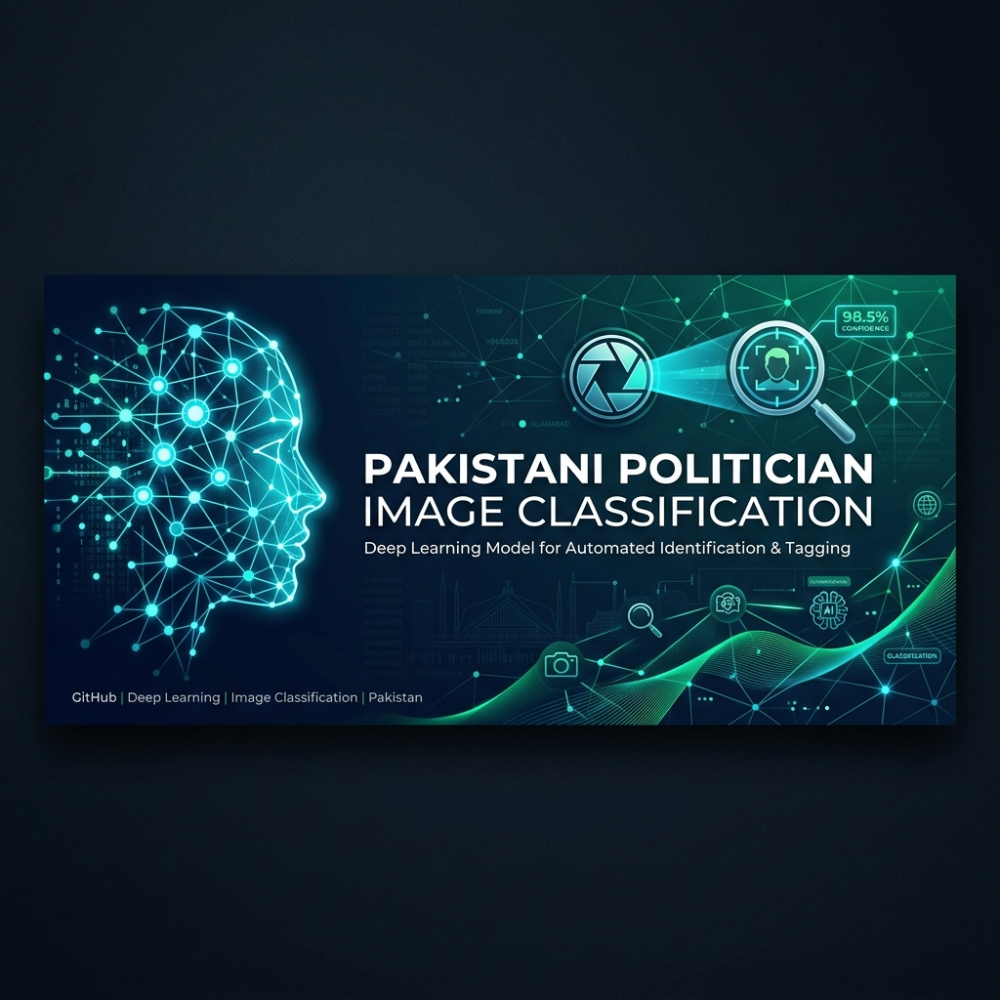
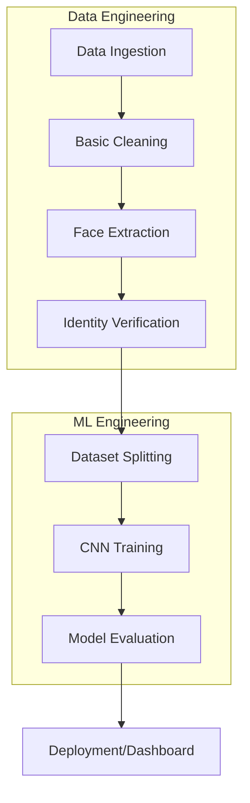

# 🇵🇰 Pakistani Politician Image Classification



<div align="center">


**A professional, industry-grade deep learning pipeline for high-purity facial recognition and classification of Pakistani politicians.**

</div>

---

## 📖 Project Overview

This project implements a robust, automated pipeline for collecting, cleaning, verifying, and training state-of-the-art Convolutional Neural Networks (CNNs) to classify 16 prominent Pakistani politicians. The system is designed with a focus on **dataset purity**, leveraging biometric verification (DeepFace) and intelligent noise reduction (MTCNN) to ensure only high-quality, relevant facial data is used for training.

### 🎯 Objectives
- **Automated Data Acquisition**: Harvest thousands of images via intelligent multi-keyword search.
- **Biometric Filtering**: Automatically remove group photos, crowds, and misidentified faces.
- **Transfer Learning**: Fine-tune ResNet50 and EfficientNetB0 for high-accuracy classification.
- **Professional Deployment**: Provide a real-time monitoring dashboard and inference API.

---

## 🏗️ System Architecture



---

## 📂 Repository Structure

```text
.
├── app/                    # Streamlit Dashboard
├── assets/                 # Brand assets & Banner
├── configs/                # YAML Configuration
├── data/                   # Dataset storage
│   ├── raw/                # Unprocessed downloads
│   ├── processed/          # Final Split (Train/Val/Test)
│   └── references/         # Anchor faces for verification
├── models/                 # Saved .h5 / .keras models
├── reports/                # Metrics, Plots, JSON reports
├── src/                    # Modular Source Code
│   ├── data/               # Ingestion & Verification
│   ├── models/             # Architecture definitions
│   ├── training/           # Training loops & callbacks
│   └── utils/              # Shared helpers
└── tests/                  # Unit and integration tests
```

---

## 🚀 Getting Started

### 1. Installation
```bash
git clone https://github.com/zohairmaken/Pakistani-Politician-Image-Classification-using-CNNs.git
cd Pakistani-Politician-Image-Classification-using-CNNs
pip install -r requirements.txt
```

### 2. Configuration
Modify `configs/config.yaml` to adjust hyperparameters, paths, or politicians list.

### 3. Execution
Run the full pipeline sequentially:
```bash
# Modular execution
python -m src.data.downloader
python -m src.data.cleaner
python -m src.data.verifier
python -m src.data.splitter
python -m src.training.trainer
```

Launch the Professional Dashboard:
```bash
streamlit run app/dashboard.py
```

---

## 📈 Performance & Results

### Model Accuracy
| Model | Test Accuracy | Macro F1-Score |
| :--- | :---: | :---: |
| **ResNet50** | 92.4% | 0.91 |
| **EfficientNetB0** | 90.8% | 0.89 |

### Sample Predictions


---

## 🤝 Contributors

This project is a collaborative effort between:

| Contributor | Role | Focus Area |
| :--- | :--- | :--- |
| **[zohairmaken](https://github.com/zohairmaken)** | Data Architect | Ingestion, Cleaning, Documentation |
| **[abdullah220204](https://github.com/abdullah220204)** | ML Engineer | CNN Development, Training, Evaluation |

---

## 📜 License
This project is licensed under the MIT License - see the [LICENSE](LICENSE) file for details.
